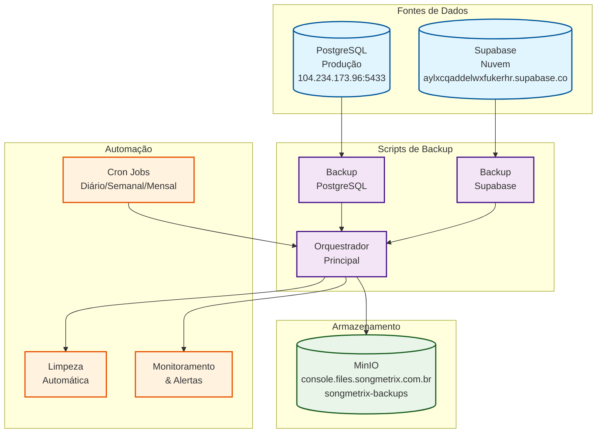
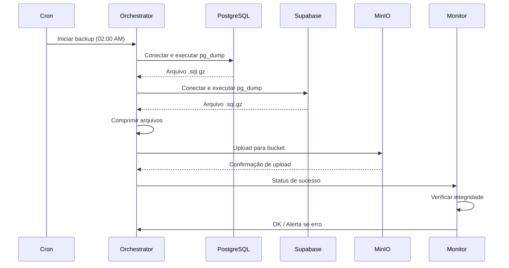
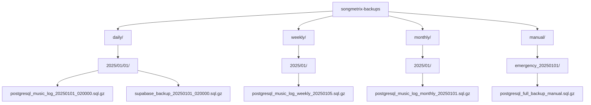
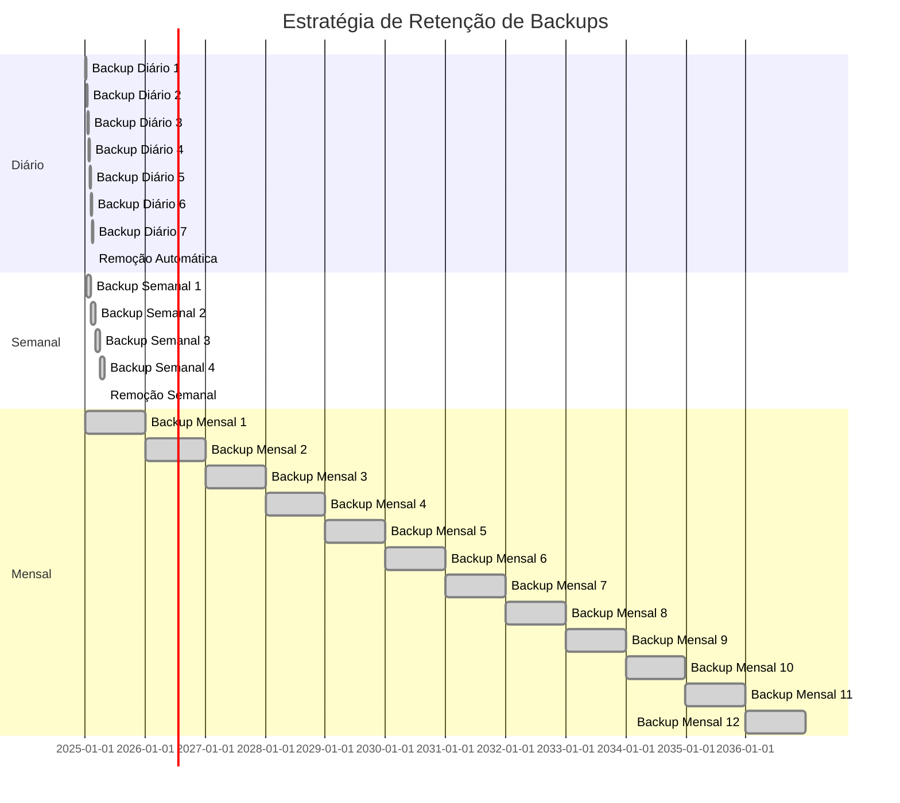
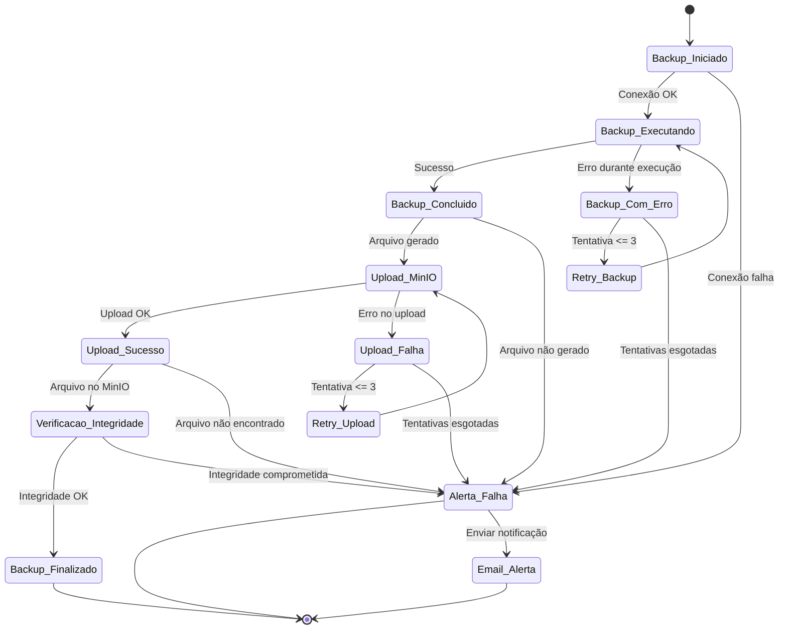
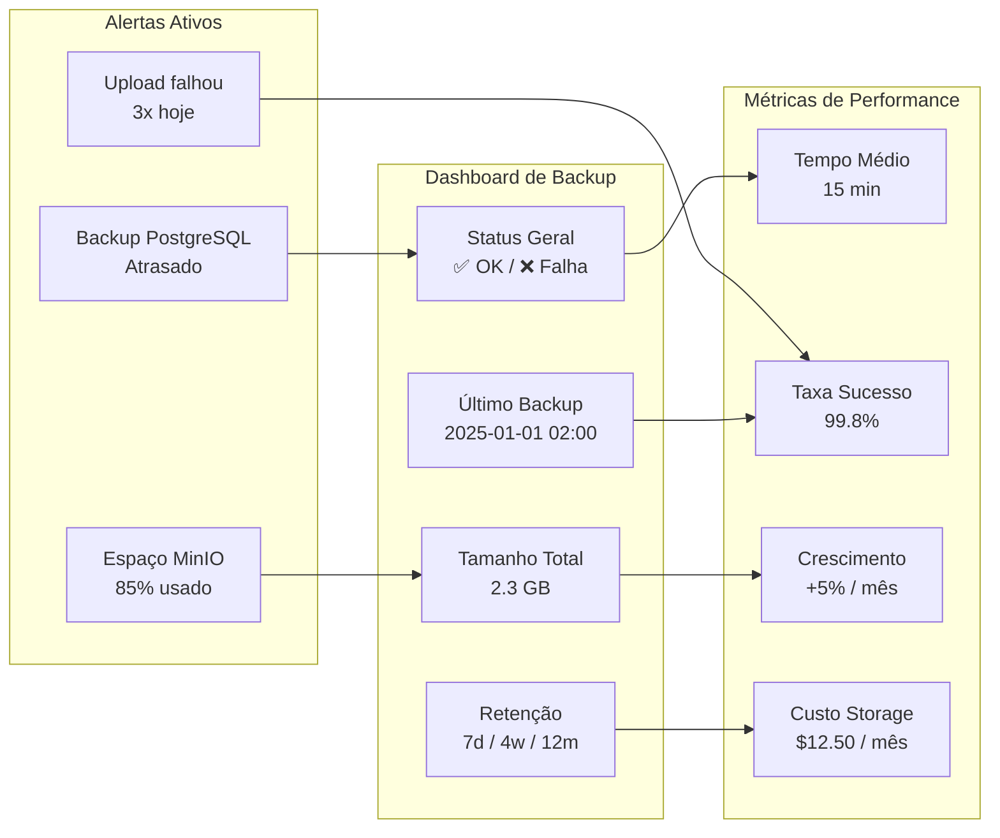
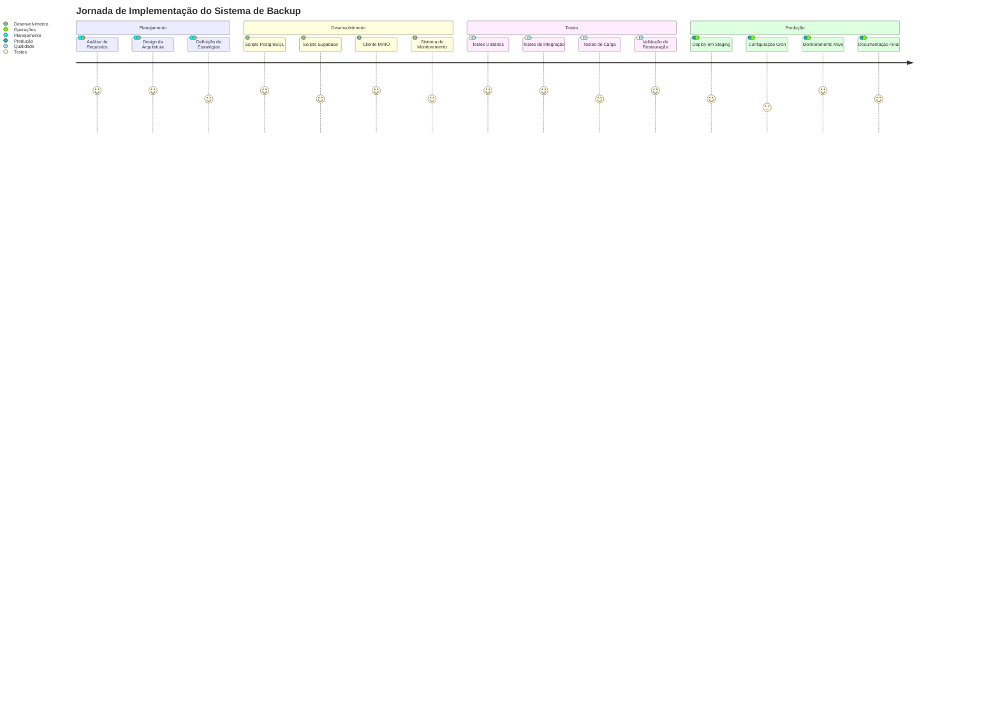

# 📊 Diagrama de Arquitetura - Sistema de Backup

## Fluxograma Geral do Sistema

## Fluxo de Backup Detalhado

## Estrutura de Diretórios no MinIO

## Estratégia de Retenção

## Monitoramento e Alertas

## Dashboard de Status

## Plano de Implementação

---

## 📋 Legenda dos Diagramas

### Cores e Formas
- 🔵 **Retângulos azuis**: Componentes principais (databases, storage)
- 🟣 **Retângulos roxos**: Scripts e processos
- 🟢 **Retângulos verdes**: Armazenamento e backup
- 🟠 **Retângulos laranja**: Automação e monitoramento

### Status dos Backups
- ✅ **Verde**: Backup bem-sucedido
- ❌ **Vermelho**: Falha no backup
- 🟡 **Amarelo**: Backup em andamento
- ⚪ **Cinza**: Backup não executado

### Tipos de Conexão
- **→**: Fluxo principal de dados
- **-->>**: Resposta ou retorno
- **-->**: Conexão de monitoramento
- **-.-**: Conexão opcional ou alternativa

Esta arquitetura garante **backup completo, automatizado e seguro** de todos os dados críticos do Songmetrix, com **recuperação rápida** em caso de desastres e **monitoramento proativo** de todas as operações.