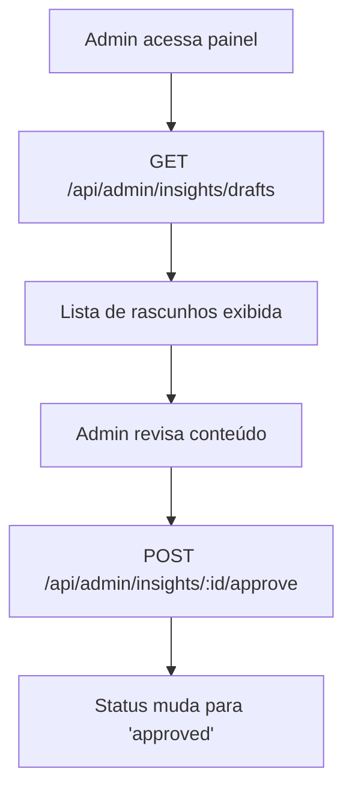
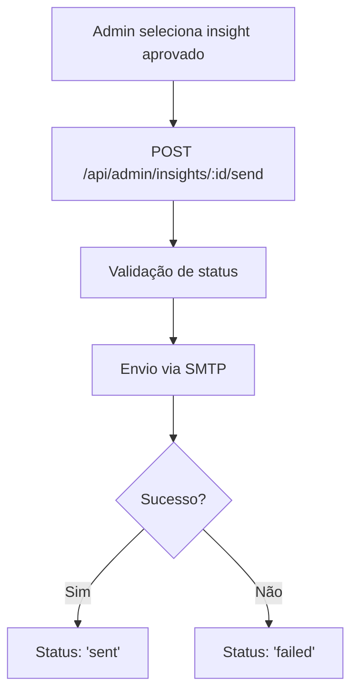

# Rotas de Admin para Insights - SongMetrix

Este documento descreve as rotas de administração implementadas para o painel de controle dos insights musicais gerados automaticamente.

## Visão Geral

As rotas de admin de insights permitem que administradores:
- Iniciem o processo de geração de insights para todos os usuários
- Revisem rascunhos gerados antes do envio
- Aprovem insights para envio
- Enviem e-mails aprovados para os usuários

## Segurança

### Middleware de Autenticação

Todas as rotas são protegidas pelo middleware `checkAdminAuth` que:
1. Verifica se o usuário está autenticado (`req.user` existe)
2. Consulta a tabela `public.admins` para confirmar permissões
3. Bloqueia acesso para não-administradores

### Estrutura de Proteção

```javascript
// Todas as rotas requerem:
app.use('/api/admin/insights', authenticateBasicUser, adminInsightRoutes);

// E internamente:
adminInsightRouter.use(checkAdminAuth);
```

## Endpoints Disponíveis

### 1. Iniciar Geração de Insights

**Endpoint:** `POST /api/admin/insights/generate`

**Descrição:** Inicia o processo de geração de insights para todos os usuários em background.

**Autenticação:** Requer admin

**Request:**
```http
POST /api/admin/insights/generate
Authorization: Bearer {admin_token}
Content-Type: application/json
```

**Response (202 Accepted):**
```json
{
  "message": "O processo de geração de insights foi iniciado. Os rascunhos estarão disponíveis para revisão em breve.",
  "status": "accepted",
  "initiated_by": "admin-user-id",
  "initiated_at": "2024-01-15T10:00:00.000Z"
}
```

**Características:**
- ✅ Processo executado em background (não bloqueia resposta)
- ✅ Resposta imediata com status 202
- ✅ Logs detalhados do processo
- ✅ Cleanup automático de conexões

**Exemplo de uso:**
```javascript
const response = await fetch('/api/admin/insights/generate', {
  method: 'POST',
  headers: {
    'Authorization': `Bearer ${adminToken}`,
    'Content-Type': 'application/json'
  }
});

if (response.status === 202) {
  console.log('Processo iniciado com sucesso!');
}
```

### 2. Listar Rascunhos para Revisão

**Endpoint:** `GET /api/admin/insights/drafts`

**Descrição:** Lista todos os insights em status 'draft' para revisão administrativa.

**Autenticação:** Requer admin

**Request:**
```http
GET /api/admin/insights/drafts
Authorization: Bearer {admin_token}
```

**Response (200 OK):**
```json
{
  "drafts": [
    {
      "id": "insight-uuid",
      "user_id": "user-uuid",
      "subject": "🚀 Sua música favorita está crescendo!",
      "content": "<html>...</html>",
      "insight_type": "growth_trend",
      "insight_data": {
        "userId": "user-uuid",
        "songTitle": "Envolver",
        "artist": "Anitta",
        "currentWeekPlays": 45,
        "previousWeekPlays": 15,
        "growthRate": "3.00"
      },
      "deep_link": "https://songmetrix.com.br/insights/growth-trend?...",
      "status": "draft",
      "created_at": "2024-01-15T10:05:00.000Z",
      "users": {
        "email": "user@example.com",
        "full_name": "Nome do Usuário"
      }
    }
  ],
  "count": 1,
  "fetched_at": "2024-01-15T10:10:00.000Z"
}
```

**Características:**
- ✅ Join automático com tabela `users` para dados do destinatário
- ✅ Ordenação por data de criação (mais recentes primeiro)
- ✅ Contagem total de rascunhos
- ✅ Dados completos do insight para revisão

### 3. Aprovar um E-mail

**Endpoint:** `POST /api/admin/insights/:id/approve`

**Descrição:** Aprova um insight específico, mudando seu status para 'approved'.

**Autenticação:** Requer admin

**Request:**
```http
POST /api/admin/insights/550e8400-e29b-41d4-a716-446655440000/approve
Authorization: Bearer {admin_token}
Content-Type: application/json
```

**Response (200 OK):**
```json
{
  "message": "Insight aprovado com sucesso",
  "insight": {
    "id": "550e8400-e29b-41d4-a716-446655440000",
    "status": "approved",
    "approved_at": "2024-01-15T10:15:00.000Z",
    "approved_by": "admin-user-id",
    "updated_at": "2024-01-15T10:15:00.000Z"
  },
  "approved_by": "admin-user-id",
  "approved_at": "2024-01-15T10:15:00.000Z"
}
```

**Erros possíveis:**
- `404` - Insight não encontrado
- `500` - Erro interno na aprovação

**Características:**
- ✅ Registra timestamp de aprovação
- ✅ Registra ID do admin que aprovou
- ✅ Atualiza campo `updated_at`
- ✅ Retorna dados atualizados

### 4. Enviar um E-mail Aprovado

**Endpoint:** `POST /api/admin/insights/:id/send`

**Descrição:** Envia um insight aprovado por e-mail para o usuário destinatário.

**Autenticação:** Requer admin

**Request:**
```http
POST /api/admin/insights/550e8400-e29b-41d4-a716-446655440000/send
Authorization: Bearer {admin_token}
Content-Type: application/json
```

**Response (200 OK):**
```json
{
  "message": "E-mail enviado com sucesso",
  "insight": {
    "id": "550e8400-e29b-41d4-a716-446655440000",
    "status": "sent",
    "sent_at": "2024-01-15T10:20:00.000Z",
    "sent_by": "admin-user-id"
  },
  "recipient": "user@example.com",
  "sent_by": "admin-user-id",
  "sent_at": "2024-01-15T10:20:00.000Z"
}
```

**Erros possíveis:**
- `400` - Status inválido (não aprovado)
- `404` - Insight não encontrado
- `500` - Falha no envio do e-mail

**Response de erro (400 Bad Request):**
```json
{
  "error": "Apenas insights aprovados podem ser enviados",
  "code": "INVALID_STATUS",
  "current_status": "draft"
}
```

**Response de erro (500 Internal Server Error):**
```json
{
  "error": "Falha no envio do e-mail",
  "code": "EMAIL_SEND_ERROR",
  "details": "SMTP connection failed"
}
```

**Características:**
- ✅ Validação de status (apenas 'approved' pode ser enviado)
- ✅ Integração com serviço SMTP existente
- ✅ Atualização automática de status para 'sent' ou 'failed'
- ✅ Registro de timestamp e admin responsável
- ✅ Tratamento de erros detalhado

## Fluxo de Trabalho Completo

### 1. Geração de Insights

```mermaid
graph TD
    A[Admin clica 'Gerar Insights'] --> B[POST /api/admin/insights/generate]
    B --> C[Processo iniciado em background]
    C --> D[InsightGeneratorService.generateInsightsForAllUsers()]
    D --> E[Rascunhos salvos com status 'draft']
    E --> F[Admin recebe confirmação 202]
```

### 2. Revisão e Aprovação



### 3. Envio de E-mails



## Estrutura de Banco de Dados

### Tabela `generated_insight_emails`

```sql
CREATE TABLE generated_insight_emails (
  id UUID PRIMARY KEY,
  user_id UUID REFERENCES users(id),
  subject TEXT NOT NULL,
  content TEXT NOT NULL,
  insight_type TEXT NOT NULL,
  insight_data JSONB,
  deep_link TEXT,
  status TEXT DEFAULT 'draft',
  created_at TIMESTAMP WITH TIME ZONE DEFAULT NOW(),
  sent_at TIMESTAMP WITH TIME ZONE,
  updated_at TIMESTAMP WITH TIME ZONE DEFAULT NOW(),
  
  -- Campos de administração
  approved_at TIMESTAMP WITH TIME ZONE,
  approved_by UUID REFERENCES auth.users(id),
  sent_by UUID REFERENCES auth.users(id),
  error_message TEXT
);
```

### Estados do Status

| Status | Descrição | Ações Permitidas |
|--------|-----------|------------------|
| `draft` | Rascunho gerado, aguardando revisão | Aprovar, Editar |
| `approved` | Aprovado por admin, pronto para envio | Enviar |
| `sent` | Enviado com sucesso | Visualizar apenas |
| `failed` | Falha no envio | Reenviar, Editar |

## Configuração e Setup

### 1. Executar Migrações

```sql
-- Execute no Supabase:
-- 1. supabase/migrations/create_generated_insight_emails_table.sql
-- 2. supabase/migrations/add_deep_link_to_generated_insight_emails.sql
-- 3. supabase/migrations/add_admin_fields_to_generated_insight_emails.sql
```

### 2. Configurar Admin

```bash
npm run add-admin USER_ID
```

### 3. Configurar LLM

```bash
npm run setup-llm
```

### 4. Configurar SMTP

Certifique-se de que as variáveis de ambiente SMTP estão configuradas:

```env
SMTP_HOST=smtp.turbosmtp.com
SMTP_PORT=587
SMTP_USER=your-username
SMTP_PASSWORD=your-password
SMTP_SECURE=false
```

### 5. Testar Rotas

```bash
npm run test-admin-insight-routes
```

## Logs e Monitoramento

### Níveis de Log

- **INFO**: Operações normais, início/fim de processos
- **WARN**: Tentativas de acesso negado, status inválidos
- **ERROR**: Erros de API, falhas de envio, problemas de banco

### Exemplos de Logs

```json
{
  "level": "info",
  "message": "[AdminInsightRoutes] Iniciando geração de insights solicitada por admin admin-123",
  "timestamp": "2024-01-15T10:00:00.000Z"
}

{
  "level": "info",
  "message": "[AdminInsightRoutes] Encontrados 5 rascunhos",
  "timestamp": "2024-01-15T10:05:00.000Z",
  "count": 5,
  "adminId": "admin-123"
}

{
  "level": "error",
  "message": "[AdminInsightRoutes] Falha no envio do insight insight-456",
  "timestamp": "2024-01-15T10:20:00.000Z",
  "error": "SMTP connection failed",
  "recipient": "user@example.com",
  "adminId": "admin-123"
}
```

## Integração Frontend

### Exemplo de Interface Admin

```typescript
// Componente React para painel de admin
import React, { useState, useEffect } from 'react';

const AdminInsightPanel = () => {
  const [drafts, setDrafts] = useState([]);
  const [loading, setLoading] = useState(false);

  // Buscar rascunhos
  const fetchDrafts = async () => {
    const response = await fetch('/api/admin/insights/drafts', {
      headers: { 'Authorization': `Bearer ${adminToken}` }
    });
    const data = await response.json();
    setDrafts(data.drafts);
  };

  // Iniciar geração
  const startGeneration = async () => {
    setLoading(true);
    const response = await fetch('/api/admin/insights/generate', {
      method: 'POST',
      headers: { 'Authorization': `Bearer ${adminToken}` }
    });
    
    if (response.status === 202) {
      alert('Geração iniciada! Aguarde alguns minutos.');
      setTimeout(fetchDrafts, 30000); // Recarregar após 30s
    }
    setLoading(false);
  };

  // Aprovar insight
  const approveInsight = async (id) => {
    const response = await fetch(`/api/admin/insights/${id}/approve`, {
      method: 'POST',
      headers: { 'Authorization': `Bearer ${adminToken}` }
    });
    
    if (response.ok) {
      fetchDrafts(); // Recarregar lista
    }
  };

  // Enviar insight
  const sendInsight = async (id) => {
    const response = await fetch(`/api/admin/insights/${id}/send`, {
      method: 'POST',
      headers: { 'Authorization': `Bearer ${adminToken}` }
    });
    
    if (response.ok) {
      alert('E-mail enviado com sucesso!');
      fetchDrafts(); // Recarregar lista
    }
  };

  return (
    <div className="admin-insight-panel">
      <h2>Painel de Insights</h2>
      
      <button onClick={startGeneration} disabled={loading}>
        {loading ? 'Gerando...' : 'Gerar Insights'}
      </button>

      <div className="drafts-list">
        {drafts.map(draft => (
          <div key={draft.id} className="draft-item">
            <h3>{draft.subject}</h3>
            <p>Para: {draft.users?.email}</p>
            <p>Tipo: {draft.insight_type}</p>
            
            {draft.status === 'draft' && (
              <button onClick={() => approveInsight(draft.id)}>
                Aprovar
              </button>
            )}
            
            {draft.status === 'approved' && (
              <button onClick={() => sendInsight(draft.id)}>
                Enviar
              </button>
            )}
          </div>
        ))}
      </div>
    </div>
  );
};
```

## Troubleshooting

### Problemas Comuns

#### "Usuário não é admin"
- **Causa**: Usuário não está na tabela `admins`
- **Solução**: Execute `npm run add-admin USER_ID`

#### "Processo de geração não inicia"
- **Causa**: LLM não configurado ou serviços não encontrados
- **Solução**: Execute `npm run setup-llm` e verifique logs

#### "Falha no envio de e-mail"
- **Causa**: Configuração SMTP incorreta
- **Solução**: Verifique variáveis `SMTP_*` no `.env`

#### "Insight não encontrado"
- **Causa**: ID inválido ou insight deletado
- **Solução**: Verifique se o insight existe na tabela

### Verificação de Saúde

```sql
-- Verificar insights por status
SELECT status, COUNT(*) as count 
FROM generated_insight_emails 
GROUP BY status;

-- Verificar últimos insights gerados
SELECT id, user_id, subject, status, created_at 
FROM generated_insight_emails 
ORDER BY created_at DESC 
LIMIT 10;

-- Verificar admins ativos
SELECT a.user_id, u.email 
FROM admins a 
LEFT JOIN auth.users u ON a.user_id = u.id;
```

## Roadmap

### Próximas Funcionalidades

1. **Edição de Rascunhos**: Permitir editar conteúdo antes da aprovação
2. **Aprovação em Lote**: Aprovar múltiplos insights de uma vez
3. **Agendamento**: Agendar envio de insights para horários específicos
4. **Templates**: Sistema de templates personalizáveis
5. **Métricas**: Dashboard com estatísticas de abertura e cliques

### Melhorias Planejadas

1. **Notificações**: Alertas para admins quando novos rascunhos estão prontos
2. **Histórico**: Log completo de ações administrativas
3. **Filtros**: Filtrar insights por tipo, usuário, data
4. **Preview**: Visualização prévia do e-mail antes do envio
5. **A/B Testing**: Testar diferentes versões de insights